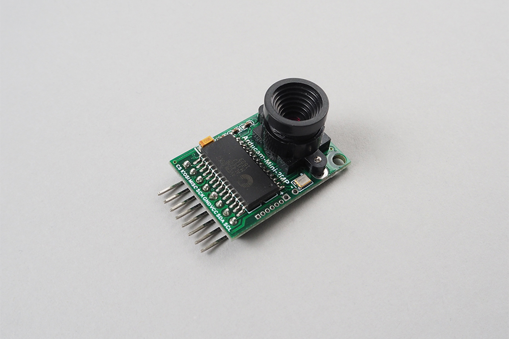

# ArduCAMMini

少ないピン数で利用できるカメラモジュールです。
たくさんの解像度を選べる上に、jpegで画像を取り出すことが出来ます。

同じArduCAMMiniでも種類がありますが、OV2640の2Mピクセルのカメラに対応しています。




## wired(obniz,  {cs [, mosi, miso, sclk, gnd, vcc, sda, scl, spi, i2c]} )

つながっているioを指定してオブジェクト化します。

このカメラの電源はobniz以外から供給する方法がおすすめです。
obnizから電源を供給する場合は過電流に気をつける必要があります。
電源は以下のように供給して下さい

- obniz以外の外部電源に接続する
- obnizのJ1ピンに接続する
- vccを2つ以上のobnizのioから供給する

このドキュメントではio11もvcc供給に使用する方法でカメラを動かしています。


このモジュールはSPIとI2Cがそれぞれ１つずつ必要です。

name | type | required | default | description
--- | --- | --- | --- | ---
cs | `number(obniz io)` | yes | &nbsp; | obniz io. チップ選択
vcc | `number(obniz io)` | no | &nbsp; | obniz io. 電源 +5V
gnd | `number(obniz io)` | no | &nbsp; | obniz io. 電源 0v
mosi | `number(obniz io)` | no | &nbsp; | obniz io. SPI mosi 端子
miso | `number(obniz io)` | no | &nbsp; | obniz io. SPI miso 端子
sclk | `number(obniz io)` | no | &nbsp; | obniz io. SPI clk 端子
sda | `number(obniz io)` | no | &nbsp; | obniz io. I2C sda 端子
scl | `number(obniz io)` | no | &nbsp; | obniz io. I2C scl 端子
i2c | `i2c object` | no | &nbsp; | configured i2c object
spi | `spi object` | no | &nbsp; | configured spi object

ピンだけを指定して以下のように設定することが出来ます。

```javascript
obniz.io11.output(true);
var cam = obniz.wired("ArduCAMMini", { cs:0, mosi:1, miso:2, sclk:3, gnd:4, vcc:5, sda:6, scl:7 });
await cam.startupWait();
const data = await cam.takeWait('1024x768');
console.log("image size = " + data.length + " bytes");

const base64 = cam.arrayToBase64(data);
document.getElementById("image").src = "data:image/jpeg;base64, " + base64;
```

または、設定済みのi2cやspiオブジェクトがあれば、それを利用することも可能です。


## [await] startupWait();

カメラを初期化します。撮影する前に一度だけ呼び出す必要があります。
この関数を呼ぶだけで

- SPI通信のテスト
- I2C通信のテスト
- 対応可能なカメラかどうかのチェック
- モードの設定とJpegカメラとしての設定
- 320x240解像度の設定

が完了します。

この初期化をしていればtakeWait()関数で撮影ができます。

```javascript
// Javascript Example
obniz.io11.output(true);
var cam = obniz.wired("ArduCAMMini", { cs:0, mosi:1, miso:2, sclk:3, gnd:4, vcc:5, sda:6, scl:7 });
await cam.startupWait();
```

startupWait()を使わないで初期化する場合は以下のような手順となります。

```javascript
// Javascript Example
obniz.io11.output(true);
var cam = obniz.wired("ArduCAMMini", { cs:0, mosi:1, miso:2, sclk:3, gnd:4, vcc:5, sda:6, scl:7 });
await cam.spi_pingpongWait();
cam.setMode('MCU2LCD');
const chipid = await cam.getChipIdWait();
if (chipid != 0x2642) {
  throw new Error('unknown chip ' + chipid)
}
cam.init();
```


## [await] takeWait(size);

撮影を行い、jpegのデータを取得します。
撮影の前にはstartupWait()関数でカメラが初期化されている必要があります。

sizeを指定すると、カメラの解像度設定を変更します。
何も指定されていないか、すでに設定済みの解像度と同じだった場合は何もしません。
sizeで指定できるのはsetSize関数で指定できるものと同じです。

返り値はjpegデータの入ったarrayとなります。
カメラとobnizの間の通信に失敗した場合はエラーとなるか、ずっと応答待ちとなりこの関数から抜けないかのどちらかとなります。


```javascript
// Javascript Example
obniz.io11.output(true);
var cam = obniz.wired("ArduCAMMini", { cs:0, mosi:1, miso:2, sclk:3, gnd:4, vcc:5, sda:6, scl:7 });
await cam.startupWait();
const jpegData = await cam.takeWait('1024x768');
```

takeWait()を使わずにstartCapture()やFIFO操作などを自分で使って撮影する場合のやり方についてはstartCapture()関数のexampleを御覧ください。

## arrayToBase64(bytearray)
arrayデータをbase64にエンコードします。
これによりjpegのbase64データを取得できます。
htmlでは``````タグにbase64のjpgを渡すと画像として見ることが出来ます。

```Javascript
obniz.io11.output(true);
var cam = obniz.wired("ArduCAMMini", { cs:0, mosi:1, miso:2, sclk:3, gnd:4, vcc:5, sda:6, scl:7 });
await cam.startupWait();
const jpegData = await cam.takeWait('1024x768');
console.log("image size = " + jpegData.length + " bytes");
  
const base64 = cam.arrayToBase64(jpegData);
document.getElementById("image").src = "data:image/jpeg;base64, " + base64;

```

## setMode(mode)

カメラのモードを設定します。
以下から選択可能です。

この関数はstartupWait()関数内で使われています。

- 'MCU2LCD'
- 'CAM2LCD'
- 'LCD2MCU'

```javascript
// Javascript Example
obniz.io11.output(true);
var cam = obniz.wired("ArduCAMMini", { cs:0, mosi:1, miso:2, sclk:3, gnd:4, vcc:5, sda:6, scl:7 });
cam.setMode('MCU2LCD')
```

## [async] spi_pingpongWait()

obnizとカメラとの間のspi通信をテストします。
カメラの電源が入っているか、配線が正しいかの確認ができます。

この関数はstartupWait()関数内で使われています。

```javascript
// Javascript Example
obniz.io11.output(true);
var cam = obniz.wired("ArduCAMMini", { cs:0, mosi:1, miso:2, sclk:3, gnd:4, vcc:5, sda:6, scl:7 });
await cam.spi_pingpongWait()
```

## [async] getChipIdWait()

カメラのチップ番号をI2C通信で取得します。
I2Cに問題があるかや、チップがサポートされているものかどうかを確認するのに使用します。

この関数はstartupWait()関数内で使われています。

```javascript
// Javascript Example
obniz.io11.output(true);
var cam = obniz.wired("ArduCAMMini", { cs:0, mosi:1, miso:2, sclk:3, gnd:4, vcc:5, sda:6, scl:7 });
const chipid = await this.getChipIdWait();
if (chipid != 0x2642) {
  throw new Error('unknown chip ' + chipid)
}
```

## init()

カメラを初期化します。
基本的な設定を行い、jpegモードにして、解像度も320*240で一度設定してしまいます。

この関数はstartupWait()関数内で使われています。

```javascript
// Javascript Example
obniz.io11.output(true);
var cam = obniz.wired("ArduCAMMini", { cs:0, mosi:1, miso:2, sclk:3, gnd:4, vcc:5, sda:6, scl:7 });
cam.setMode('MCU2LCD')
cam.init()
```

## setSize(size)

カメラの解像度を指定します。
選択できるのは

- '160x120'
- '176x144'
- '320x240'
- '352x288'
- '640x480'
- '800x600'
- '1024x768'
- '1280x960'
- '1600x1200'

のうちのいずれかです。

解像度を変更したあとには1秒ほどの待ち時間を設定するのが良いようです。


```javascript
// Javascript Example
obniz.io11.output(true);
var cam = obniz.wired("ArduCAMMini", { cs:0, mosi:1, miso:2, sclk:3, gnd:4, vcc:5, sda:6, scl:7 });
await cam.startupWait();
cam.setSize('1600x1200');
obniz.wait(1000);
```

## flushFIFO()

FIFO内の内容をクリアします。
startCapture()関数で撮影を開始すときには２度呼ぶ必要があります。

この関数はtakeWait()関数内で使われています。

```javascript
// Javascript Example
obniz.io11.output(true);
var cam = obniz.wired("ArduCAMMini", { cs:0, mosi:1, miso:2, sclk:3, gnd:4, vcc:5, sda:6, scl:7 });
await cam.startupWait();
cam.flushFIFO();
cam.flushFIFO();
cam.startCapture();
while (true) {
  if ((await this.isCaptureDoneWait())) { break; }
}
const jpegData = await cam.readFIFOWait();
```

## startCapture()

撮影を開始します。
ただし、すぐに撮影は終わりません。終わったかどうかはisCaptureDoneWait()関数で調べます。

この関数はtakeWait()関数内で使われています。


```javascript
// Javascript Example
obniz.io11.output(true);
var cam = obniz.wired("ArduCAMMini", { cs:0, mosi:1, miso:2, sclk:3, gnd:4, vcc:5, sda:6, scl:7 });
await cam.startupWait();
cam.flushFIFO();
cam.flushFIFO();
cam.startCapture();
while (true) {
  if ((await this.isCaptureDoneWait())) { break; }
}
const jpegData = await cam.readFIFOWait();
```

## [await] isCaptureDoneWait()

startCapture()で開始した撮影が、終わってデータを取れる状態になったかを調べます。

この関数はtakeWait()関数内で使われています。

```javascript
// Javascript Example
obniz.io11.output(true);
var cam = obniz.wired("ArduCAMMini", { cs:0, mosi:1, miso:2, sclk:3, gnd:4, vcc:5, sda:6, scl:7 });
await cam.startupWait();
cam.flushFIFO();
cam.flushFIFO();
cam.startCapture();
while (true) {
  if ((await this.isCaptureDoneWait())) { break; }
}
const jpegData = await cam.readFIFOWait();
```

## [await] readFIFOWait()

カメラのFIFOに入っている撮影されたデータを取り出します。

この関数はtakeWait()関数内で使われています。

```javascript
// Javascript Example
obniz.io11.output(true);
var cam = obniz.wired("ArduCAMMini", { cs:0, mosi:1, miso:2, sclk:3, gnd:4, vcc:5, sda:6, scl:7 });
await cam.startupWait();
cam.flushFIFO();
cam.flushFIFO();
cam.startCapture();
while (true) {
  if ((await this.isCaptureDoneWait())) { break; }
}
const jpegData = await cam.readFIFOWait();
```
