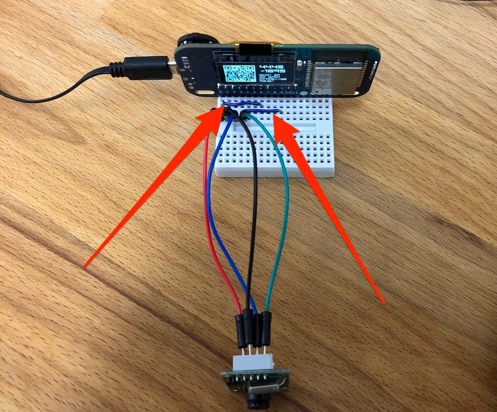

# JpegSerialCam

撮影した画像をjpgにして、UARTで送信するカメラです。


<iframe width="560" height="315" src="https://www.youtube.com/embed/CYoMmMoa3ao" frameborder="0" allow="autoplay; encrypted-media" allowfullscreen></iframe>

```Javascript
// Javascript Example
obniz.io6.output(true);
obniz.io9.output(false);
var cam = obniz.wired("JpegSerialCam", {vcc:0, cam_tx:1, cam_rx:2, gnd:3});
await cam.startWait({baud: 38400});
await cam.setSizeWait("640x480");
var data = await cam.takeWait();
```

## wire(obniz, {vcc, cam_tx, cam_rx, gnd})
電源とUARTを接続します。cam_txはカメラ側のtxと言う意味です。

このカメラの電源はobniz以外から供給する方法がおすすめです。
obnizから電源を供給する場合は過電流に気をつける必要があります。
電源は以下のように供給して下さい

- obniz以外の外部電源に接続する
- obnizのJ1ピンに接続する
- vccとgndを2つ以上のobnizのioから供給する

このドキュメントではio6とio9もvcc/gnd供給に使用する方法でカメラを動かしています。



```Javascript
obniz.io6.output(true);
obniz.io9.output(false);
var cam = obniz.wired("JpegSerialCam", {vcc:0, cam_tx:1, cam_rx:2, gnd:3});
```

## [await] startWait({[.baud]})
カメラを開始します。リセットが入るので2.5sほどかかります。

通信速度も指定できます。指定しない場合はカメラの工場出荷設定である38400となっています。
カメラは一度速度の設定を変えると、電源を切ってもその設定を覚えます。
なので、速度の設定を変えた場合、次にstartWait()で開始するときには変えた方の速度を指定する必要があります。

```Javascript
// Javascript Example
obniz.io6.output(true);
obniz.io9.output(false);
var cam = obniz.wired("JpegSerialCam", {vcc:0, cam_tx:1, cam_rx:2, gnd:3});
await cam.startWait({baud: 38400});
var data = await cam.takeWait();
```

## [await] setSizeWait(resolution)
解像度を指定します。
解像度は電源を消してもカメラ側に保存されます。

1. "640x480" (image size around 40kb)
2. "320x240" (image size around 12kb)
3. "160x120" (image size arond 4kb)

上記が利用できます。小さいほど早く撮影できますが粗いです。

```Javascript
// Javascript Example
obniz.io6.output(true);
obniz.io9.output(false);
var cam = obniz.wired("JpegSerialCam", {vcc:0, cam_tx:1, cam_rx:2, gnd:3});
await cam.startWait({baud: 38400});
await cam.setSizeWait("640x480");
var data = await cam.takeWait();
```

## [await] setBaudWait(baud)
カメラとの通信速度を決めます。早いほうが早く撮影できます。
この設定は電源を消してもカメラ側に保存されますので、変えた場合は次回のstartWait()では変えた方の速度を指定する必要があります。

1. 9600
2. 19200
3. 38400
4. 57600
5. 115200

上記が利用できます。
早いほうが良いですが、Wifiが遅い場合はデータを転送しきれないことがあります。

```Javascript
// Javascript Example
obniz.io6.output(true);
obniz.io9.output(false);
var cam = obniz.wired("JpegSerialCam", {vcc:0, cam_tx:1, cam_rx:2, gnd:3});
await cam.startWait({baud: 38400});
await cam.setBaudWait(115200);
await cam.takeWait(); // baud is already changed to 115200.
```

## [await] takeWait()
カメラで撮影し、jpegデータを取得します。

```Javascript
// Javascript Example
obniz.io6.output(true);
obniz.io9.output(false);
var cam = obniz.wired("JpegSerialCam", {vcc:0, cam_tx:1, cam_rx:2, gnd:3});
await cam.startWait({baud: 38400});
var jpegData = await cam.takeWait();
```

## arrayToBase64(bytearray)
arrayデータをbase64にエンコードします。
これによりjpegのbase64データを取得できます。
htmlでは``````タグにbase64のjpgを渡すと画像としてみることが出来ます。

```Javascript
obniz.io6.output(true);
obniz.io9.output(false);
var cam = obniz.wired("JpegSerialCam", {vcc:0, cam_tx:1, cam_rx:2, gnd:3});
await cam.startWait({baud: 38400});
const jpegData = await cam.takeWait();
document.getElementById("ItemPreview").src = "data:image/png;base64," + cam.arrayToBase64(jpegData);
```