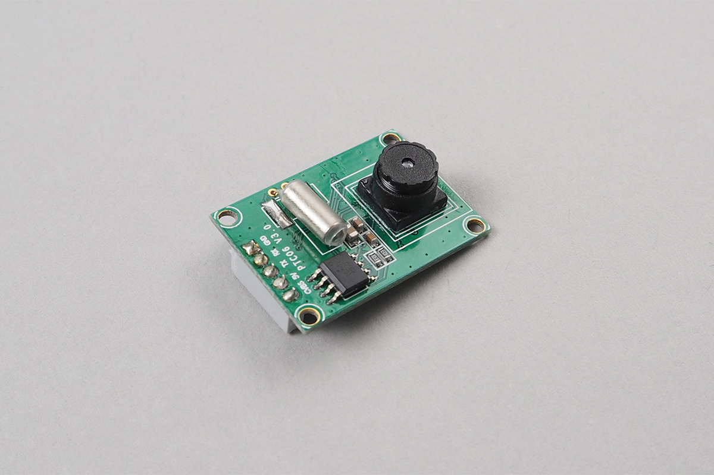

# JpegSerialCam
JpegCamera PTC06



<iframe width="560" height="315" src="https://www.youtube.com/embed/CYoMmMoa3ao" frameborder="0" allow="autoplay; encrypted-media" allowfullscreen></iframe>

```Javascript
// Javascript Example
obniz.io6.output(true);
obniz.io9.output(false);
var cam = obniz.wired("JpegSerialCam", {vcc:0, cam_tx:1, cam_rx:2, gnd:3});
await cam.startWait({baud: 38400});
await cam.setSizeWait("640x480");
var data = await cam.takeWait();
```

## wire(obniz, {vcc, cam_tx, cam_rx, gnd})
connect PowerSupply and UART.
cam_tx measn transmit from camera.

We recommend to supply power to an arducam from other power resource.
You should pay attention over current detection when using an obniz as poewr supply.
Supply methods are

- use other power resource
- use J1 on an obniz.
- supply vcc more than two obniz io

This document use io5 and io11 to supply a vcc.


```Javascript
obniz.io6.output(true);
obniz.io9.output(false);
var cam = obniz.wired("JpegSerialCam", {vcc:0, cam_tx:1, cam_rx:2, gnd:3});
```

## [await] startWait({baud:baudrate})
start camera.
It takes around 2.5 second.

Default Baudrate = 38400
```Javascript
// Javascript Example
obniz.io6.output(true);
obniz.io9.output(false);
var cam = obniz.wired("JpegSerialCam", {vcc:0, cam_tx:1, cam_rx:2, gnd:3});
await cam.startWait({baud: 38400});
var data = await cam.takeWait();
```

## [await] setSizeWait(resolution)
set image resolution
This configuration consists even after power off.

1. "640x480" (image size around 40kb)
2. "320x240" (image size around 12kb)
3. "160x120" (image size arond 4kb)

are available.
data size depends on what you take.
```Javascript
// Javascript Example
obniz.io6.output(true);
obniz.io9.output(false);
var cam = obniz.wired("JpegSerialCam", {vcc:0, cam_tx:1, cam_rx:2, gnd:3});
await cam.startWait({baud: 38400});
await cam.setSizeWait("640x480");
var data = await cam.takeWait();
```

## [await] setBaudWait(baud)
set baudrate of cam.
This configuration consists even after power off.

1. 9600
2. 19200
3. 38400
4. 57600
5. 115200

are avaiable.
High-speed is better. But, if the Wifi network speed is slow, then obniz will lost the data when high-speed.

```Javascript
// Javascript Example
obniz.io6.output(true);
obniz.io9.output(false);
var cam = obniz.wired("JpegSerialCam", {vcc:0, cam_tx:1, cam_rx:2, gnd:3});
await cam.startWait({baud: 38400});
await cam.setBaudWait(115200);
await cam.takeWait(); // baud is already changed to 115200.
```

## [await] takeWait()
take a photo and return a byte array.

```Javascript
// Javascript Example
obniz.io6.output(true);
obniz.io9.output(false);
var cam = obniz.wired("JpegSerialCam", {vcc:0, cam_tx:1, cam_rx:2, gnd:3});
await cam.startWait({baud: 38400});
var jpegData = await cam.takeWait();
```

## arrayToBase64(bytearray)
convert bytearray to base64 string.
It is useful when you want to print image to image tag

```Javascript
// Javascript Example
obniz.io6.output(true);
obniz.io9.output(false);
var cam = obniz.wired("JpegSerialCam", {vcc:0, cam_tx:1, cam_rx:2, gnd:3});
await cam.startWait({baud: 38400});
const jpegData = await cam.takeWait();
document.getElementById("ItemPreview").src = "data:image/png;base64," + cam.arrayToBase64(jpegData);
```