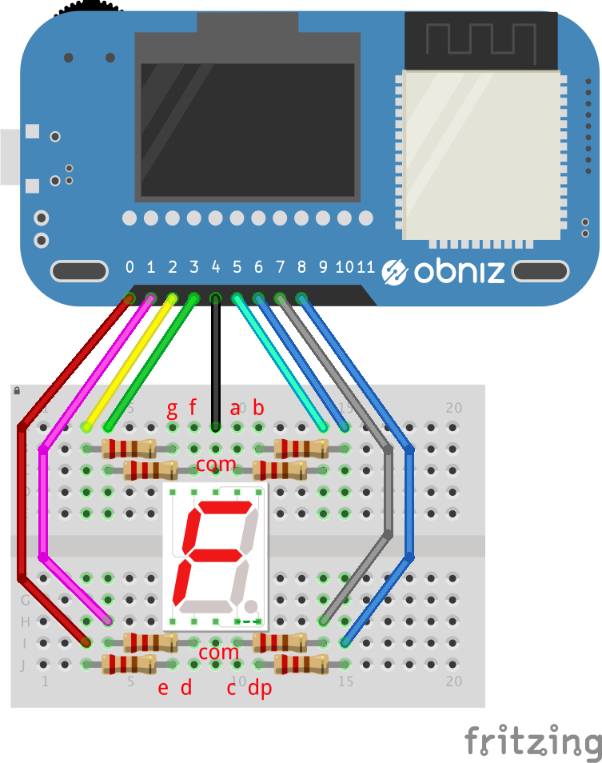

# 7SegmentLED
7 Segment LED. Cathode/Anode Common.


## wired(obniz,{ a, b, c, d, e, f, g, dp, common, commonType})
a to g is 7 segment's io.
dp is deciminal point.
commonType must be "anode"/"cathode". default is "cathode".

```javascript
// Javascript Example
var seg = obniz.wired("7SegmentLED", {a:7, b: 8, c: 1, d:2, e:3, f:5, g:4, dp:0, common:6, commonType:"cathode"});
seg.print(7);
```




## print(number)
print a number.

.print(7) => 7

.print(89) => 9

```javascript
// Javascript Example
var seg = obniz.wired("7SegmentLED",  {a:7, b: 8, c: 1, d:2, e:3, f:5, g:4, dp:0, common:6, commonType:"cathode"});

for(var i=0; i<10; i++){
  seg.print(i)
  await obniz.wait(1000);
}
```

## printRaw(number)
control each led directly.
```javascript
// Javascript Example
var seg = obniz.wired("7SegmentLED", {a:7, b: 8, c: 1, d:2, e:3, f:5, g:4, dp:0, common:6, commonType:"cathode"});
seg.print_raw(0x77)
```

## off()
turn display off
```javascript
// Javascript Example
var seg = obniz.wired("7SegmentLED",  {a:7, b: 8, c: 1, d:2, e:3, f:5, g:4, dp:0, common:6, commonType:"cathode"});

for(var i=0; i<10; i++){
  seg.print(i)
  await obniz.wait(1000);
}
seg.off();
```

## on()
turn display on
```javascript
// Javascript Example
var seg = obniz.wired("7SegmentLED",  {a:7, b: 8, c: 1, d:2, e:3, f:5, g:4, dp:0, common:6, commonType:"cathode"});

seg.print(7);
while(true){
  seg.on();
  await obniz.wait(1000);
  seg.off();
  await obniz.wait(1000);
}
```

## dpState(show)
turn on/off dp
```javascript
// Javascript Example
var seg = obniz.wired("7SegmentLED",  {a:7, b: 8, c: 1, d:2, e:3, f:5, g:4, dp:0, common:6, commonType:"cathode"});

seg.print(7);
while(true){
  seg.dpState(true);
  await obniz.wait(1000);
  seg.dpState(false);
  await obniz.wait(1000);
}
```
