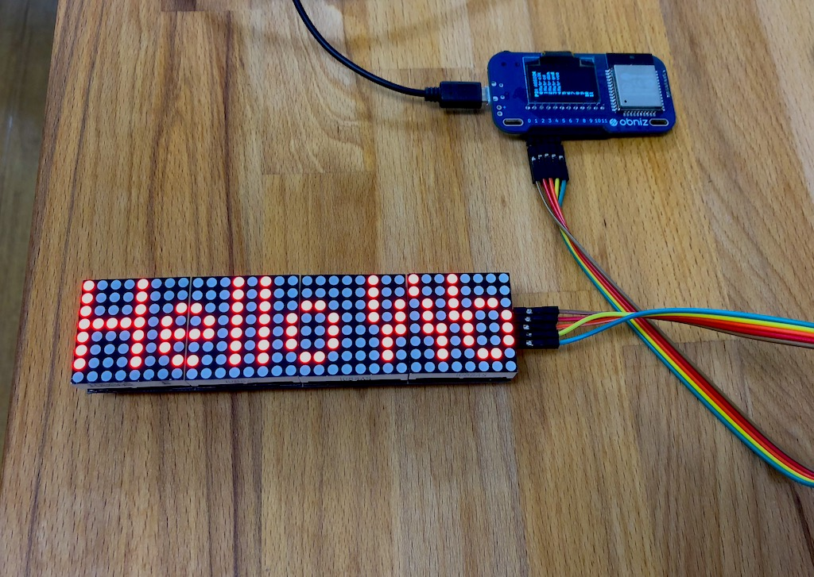
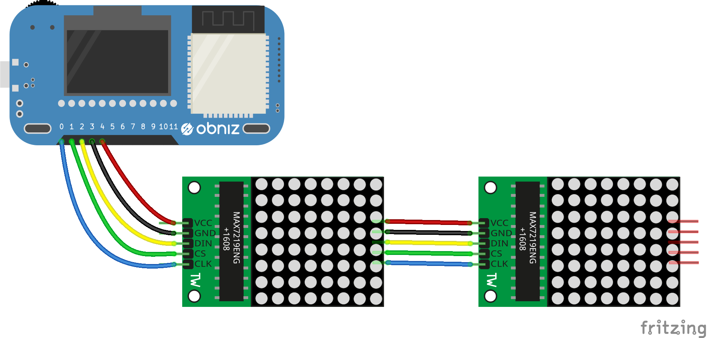

# MatrixLED_MAX7219
複数LEDを操作するMAX219チップと連携するクラスです。
7セグメントやマトリックスLEDとセットで販売されていることが多く、色々な表示が可能です。
また、連続してつなげることができるのも特徴です。

[http://akizukidenshi.com/catalog/g/gM-09984/](http://akizukidenshi.com/catalog/g/gM-09984/)




<iframe width="560" height="315" src="https://www.youtube.com/embed/5teMmFK1_FY" frameborder="0" allow="autoplay; encrypted-media" allowfullscreen></iframe>

## wired(obniz,  { clk, cs, din, gnd, vcc});

1. vcc: 電源のプラスです。
2. gnd: 電源のマイナスです。
3. din: SPIの MOSI ピンです。
4. cs: チップ選択です。
 
チェーン上に複数繋ぐ場合は１つだけをobnizにつなぎ、残りはこのように接続して下さい。



```Javascript
// Javascript Example
const matrix = obniz.wired("MatrixLED_MAX7219", { clk:0, cs:1, din:2, gnd:3, vcc:4});
```

## init(width, height)

マトリックスを初期化します。
1つのMAX7219が8*8のマトリックスを持っている必要があり、
そのマトリックスが横にどれだけつながっているかを指定します。
２つであれば width = 16, height=8となります。

```Javascript
// Javascript Example
const matrix = obniz.wired("MatrixLED_MAX7219",  { clk:0, cs:1, din:2, gnd:3, vcc:4});
matrix.init(8*2, 8);
```

## brightness(value)
明るさで、0~15が指定できます。

```Javascript
// Javascript Example
const matrix = obniz.wired("MatrixLED_MAX7219", { clk:0, cs:1, din:2, gnd:3, vcc:4});
matrix.init(8*2, 8);
matrix.brightness(7);
```

## draw(ctx)
HTML5のcanvasをそのまま描画します。html上でobnizを使っている場合は

```obniz.util.createCanvasContext()```

を使うことで、canvasを簡単に生成できます。nodejsの場合はnode-canvasを使うことが出来ます。
あとは、そこに描画し、この関数に渡すと２値化されてディスプレイに表示されます。

```Javascript
// Javascript Example
const matrix = obniz.wired("MatrixLED_MAX7219", { clk:0, cs:1, din:2, gnd:3, vcc:4});
matrix.init(8*4, 8);
matrix.brightness(7);

const ctx = obniz.util.createCanvasContext(matrix.width, matrix.height);
ctx.fillStyle = "black";
ctx.fillRect(0, 0, matrix.width, matrix.height);
ctx.fillStyle = "white";
ctx.font = "9px sans-serif";
ctx.fillText('Hello World', 0, 7);

matrix.draw(ctx);
```

## clear()
すべてを消去します。

```Javascript
// Javascript Example
const matrix = obniz.wired("MatrixLED_MAX7219",  { clk:0, cs:1, din:2, gnd:3, vcc:4});
matrix.init(8*4, 8);
matrix.clear();
```

## test()
MAX7219にあるテストコマンドを利用します。
最後に表示されていたものが表示されます。

```Javascript
// Javascript Example
const matrix = obniz.wired("MatrixLED_MAX7219", { clk:0, cs:1, din:2, gnd:3, vcc:4});
matrix.init(8*4, 8);
matrix.test();
```