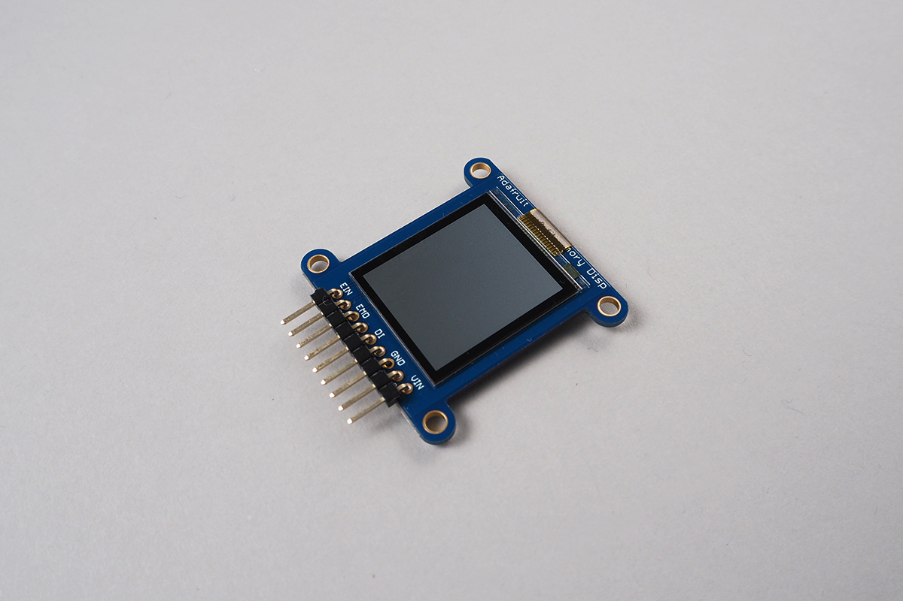
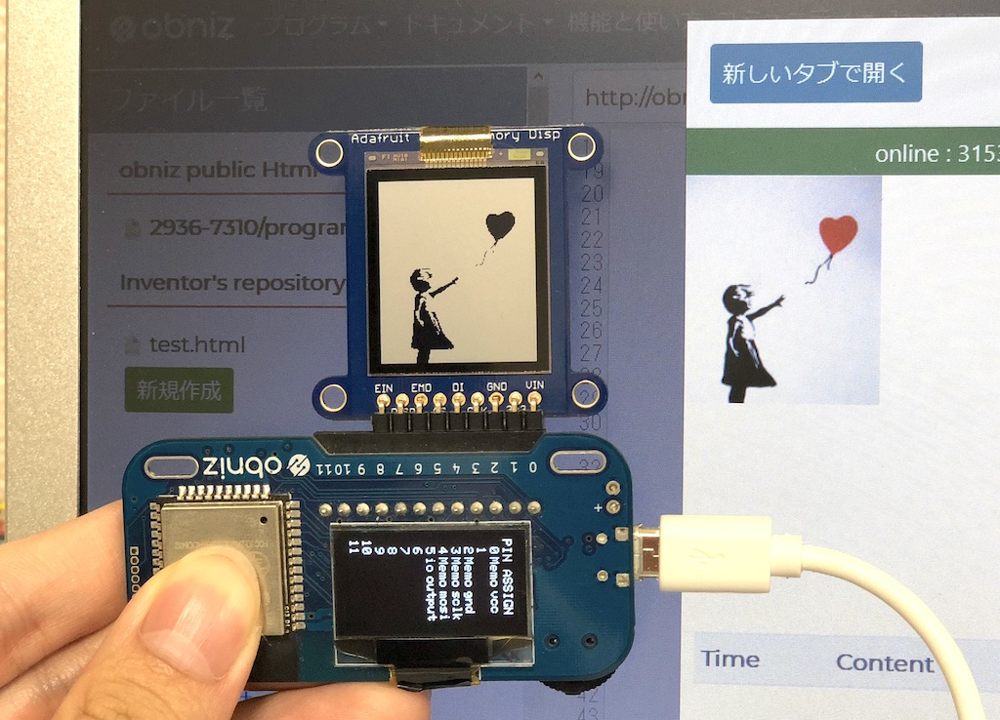

# SharpMemoryTFT

Sharp製の液晶で、ハイコントラスト・省電力が特徴です。



このライブラリは以下のようなシャープのメモリ液晶(LS013B4DN04など)を搭載したモジュールで使用することができます。

[Adafruit SHARP Memory Display Breakout - 1.3" 168x144](https://www.adafruit.com/product/3502)

[Adafruit SHARP Memory Display Breakout - 1.3" 96x96](https://www.adafruit.com/product/1393)




## wired(obniz,  { sclk, mosi, cs, width, height [vcc, gnd]} )
obnizに液晶モジュールをつなぎます。
液晶ユニットは3.3V駆動です。このライブラリでは、レギュレーターを使う前提でvinに対して5V出力になります。Adafruit社製のようにレギューレーターを内臓していないモジュールを使用する場合は注意してください。
液晶との通信にSPIを使用しています。使用していないSPIが1つ以上必要です。
widthに液晶の横ドット数、heightに縦ドット数を指定します。
```javascript
// Javascript Example
mdisp = obniz.wired("SharpMemoryTFT", {vcc:0 , gnd:2 , sclk:3 , mosi:4, cs:5, width:144, height:168});
display.clear();

for (var i=0;i<10; i++) {
  var x = Math.random() * 144;
  var y = Math.random() * 168;
  var r = Math.random() * 168;
  display.circle(x, y, r, false);
  await obniz.wait(1);
}
```

## 描画関数

描画関数はDisplayと共通です。(qr関数を除く。)
詳しくは[Displayのページ](https://obniz.io/doc/sdk/doc/display)をご覧ください。

## Canvas contextを使って画像を表示するサンプル
"Image address here"の部分を画像のアドレスに変えると、二値化された画像がディスプレイに表示されます。
```javascript
mdisp = obniz.wired("SharpMemoryTFT", {vcc:0 , gnd:2 , sclk:3 , mosi:4, cs:5, width:144, height:168});
mdisp.clear();

var canvas = document.getElementById('canvas');
if ( ! canvas || ! canvas.getContext ) { return false; }
var ctx = canvas.getContext('2d');
var img = new Image();
img.src = "Image address here";
img.onload = function() {
  ctx.drawImage(img, 0, 0);
  mdisp.draw(ctx);
}
```
