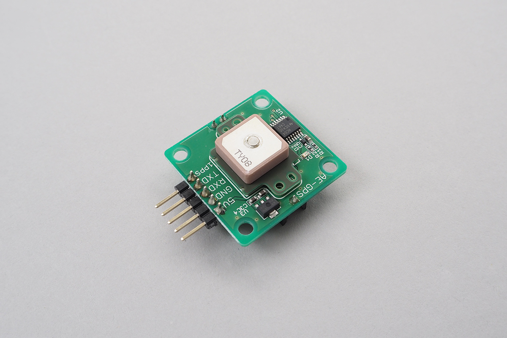

# GYSFDMAXB

Library for GPS Module [GYSFDMAXB](https://www.yuden.co.jp/jp/product/category/module/GYSFDMAXB.html).

 

## wired(vcc, gnd, txd, rxd {, Opps })

Connect vcc(5v), gnd, txd, rxd, Opps to an obniz.
And specify the pins on program.

```javascript
// Javascript Example
let gps = obniz.wired("GYSFDMAXB", { vcc:7, gnd:8, txd:9, rxd:10, Opps:11 });
let sentence = gps.readSentence();
```

This module start blinking LED and output pulse at 1PPS while receiving GPS signal.

Opps is optional.


## start1pps(callback)

callback will be called every 1pps regarding Opps.

```javascript
// Javascript Example
let gps = obniz.wired("GYSFDMAXB", { vcc:7, gnd:8, txd:9, rxd:10, Opps:11 });
gps.start1pps(function() {
  console.log("1pps received.");
});
```


## readSentence()

Read and analyze one sentence (one line) from received ([NMEA Format](https://ja.wikipedia.org/wiki/NMEA_0183)).
Empty string will be returned when no data received.

This method is useful only when NMEA direct use.
Recommended for almost user is `getEditedData()`.

```javascript
// Javascript Example
let gps = obniz.wired("GYSFDMAXB", { vcc:7, gnd:8, txd:9, rxd:10, Opps:11 });
let sentence = gps.readSentence();
```

## getEditedData()

Get GPS info object from received NMEA format.
Same data is set to editedData property.

- editedData.enable : indicate having datas below
- editedData.GPGGA : GPGGA sentence data
- editedData.GPGLL : GPGLL sentence data
- editedData.GPGSA : GPGSA sentence data
- editedData.GPGSV[ ] : GPGSV array of sentence data
- editedData.GPRMC : GPRMC sentence data
- editedData.GPVTG : GPVTG sentence data
- editedData.GPZDA : GPZDA sentence data
- editedData.xxx : otherxxx sentence data
- editedData.timestamp : GPZDA sentence data's date(Date object)

```javascript
// Javascript Example
let gps = obniz.wired("GYSFDMAXB", { vcc:7, gnd:8, txd:9, rxd:10, Opps:11 });

function mainLoop() {
  var data = gps.getEditedData();
  if (data.enable) {
    if (data.GPGGA)    console.log(data.GPGGA.join(","));
    if (data.GPGLL)    console.log(data.GPGLL.join(","));
    if (data.GPGSA)    console.log(data.GPGSA.join(","));
    if (data.GPGSV[0]) console.log(data.GPGSV[0].join(","));
    if (data.GPGSV[1]) console.log(data.GPGSV[1].join(","));
    if (data.GPGSV[2]) console.log(data.GPGSV[2].join(","));
    if (data.GPGSV[3]) console.log(data.GPGSV[3].join(","));
    if (data.GPRMC)    console.log(data.GPRMC.join(","));
    if (data.GPVTG)    console.log(data.GPVTG.join(","));
    if (data.GPZDA)    console.log(data.GPZDA.join(","));
    if (data.PMTK010)  console.log(data.PMTK010.join(","));
    if (data.PMTK011)  console.log(data.PMTK011.join(","));
  }
  setTimeout(mainLoop, 100);
}

setTimeout(mainLoop, 10);
```


## static methods

Data conversion methods for NMEA format.

- nmea2dms(value)<br>
Latitude/Longitude of NMEA to DMS format string (999°99'99.9")

- nmea2dm(value)<br>
Latitude/Longitude of NMEA to DM format string (999°99.9999')

- nmea2dd(value)<br>
Latitude/Longitude of NMEA to DD format string (999.999999)

- nmea2s(value)<br>
Latitude/Longitude of NMEA to S format string (0.999999999)


```javascript
// Javascript Example

  let d = gps.getEditedData();
  if (d.enable) {
    if (d.GPGGA) { 
      let p = d.GPGGA;
      if (p[6] != "0") {
        // Longitude
        let longitude = GYSFDMAXB.nmea2s(p[2]);
        // Latitude
        let latitude = GYSFDMAXB.nmea2s(p[4]);
        
        ・・・
        
      }
    }
  }

```

[Reference](https://www.petitmonte.com/robot/howto_gysfdmaxb.html)

---

Merged Pull Request

[https://github.com/obniz/obniz/pull/127](https://github.com/obniz/obniz/pull/127)
