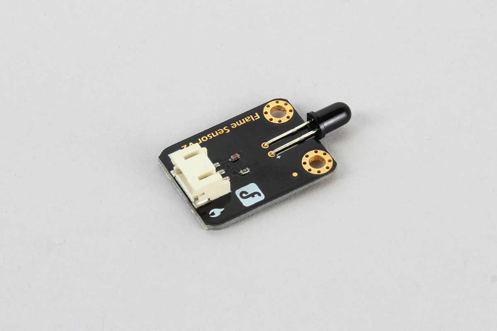

# YG1006

Fire detectin by using infrared sensor.

Below image is DFROBOT's module using YG1006.



## wired(obniz, { signal[, vcc, gnd]});

name | type | required | default | description
--- | --- | --- | --- | ---
signal | `number(obniz Board io)` | yes |  &nbsp; | output pin. (blue connector of DFROBOT's module)
vcc | `number(obniz Board io)` | no |  &nbsp; | vcc (red connector of DFROBOT's module)
gnd | `number(obniz Board io)` | no |  &nbsp; | gnd (black connector of DFROBOT's module)

YG1006 is a infrared sensor. Output current of signal change regarding infrared from fire.
It can be read by using resistors.
DFROBOT's module already has resistors so can be connect and read easily.

```Javascript
// Javascript Example
var YG1006 = obniz.wired("YG1006", {gnd:0, vcc:1, signal:2});
YG1006.onchange = function(voltage) {
  console.log(voltage);
}
```

## onchange = function(voltage)

Change callback of infrared strength change.
It's voltage range is gnd to vcc.
Voltage will increase by infrared.

Normally output voltage is around 0.02 when vcc=5. It will increased to 0.3 when it closed to a fire.

```Javascript
// Javascript Example
var YG1006 = obniz.wired("YG1006", {gnd:0, vcc:1, signal:2});
YG1006.onchange = function(voltage) {
  console.log(voltage);
}
```

## [await] getWait()

Read voltage at onece.

```Javascript
// Javascript Example
var YG1006 = obniz.wired("YG1006", {gnd:0, vcc:1, signal:2});
const voltage = await YG1006.getWait();
console.log(voltage);
```