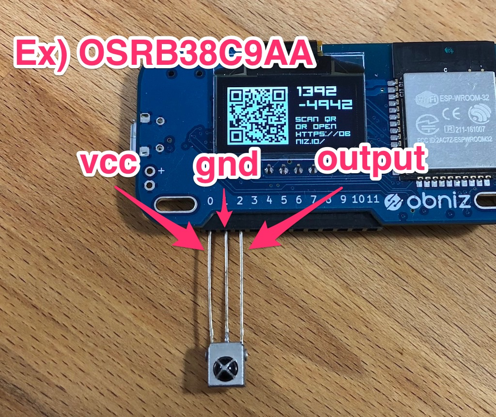

# IRSensor

リモコンで使われる赤外線の信号を検出します。


## wired(obniz, {output [vcc, gnd]})

vccとgndを接続します。(vccとgndはオプショナルです。外に繋いでいる場合は無くても大丈夫です。)
outputはセンサーのoutputにつなぎます。

一般的なフィルター付き赤外線リモコン受信回路などはそのまま接続可能です。

以下は動くことが分かっている部品です。

1. [OSRB38C9AA](http://akizukidenshi.com/download/OSRB38C9AA.pdf)
2. [TFMS5380](https://www.voti.nl/docs/tfms5360.pdf) etc,,,

部品によってピンの順番が違いますので注意して下さい。




そして、プログラム上で刺した場所を指定します。

```javascript
// Javascript Example
var sensor = obniz.wired('IRSensor', {vcc:0, gnd:1, output: 2});
```

## start(callback(array))
モニターを開始ます。検出したら引数に渡した関数が呼ばれます。

```javascript
// Javascript Example
var sensor = obniz.wired('IRSensor', {vcc:0, gnd:1, output: 2});
sensor.start(function (arr) {
  console.log('detected!!')
  console.log(JSON.stringify(arr));
})
```

結果であるarrには ```obniz.LogicAnalyzer```で得られのと同じ配列が入っています。
なので、こんなフォーマットです。

```
[1,1,1,1,1,1,1,1,1,1,1,1,1,1,1,1,1,1,1,1,1,1,1,1,1,1,1,1,1,1,1,1,1,1,1,1,1,1,1,1,1,1,1,1,1,1,1,1,0,0,0,0,0,0,0,0,0,0,0,0,0,0,0,0,0,0,0,0,0,0,0,0,1,1,1,1,1,1,0,0,0,0,0,0,0]
```

```start()```で開始する前にオプションを設定することが出来ます。
```obniz.LogicAnalyzer```のオプションと共通ですので、詳しくはそちらをご覧ください。

設定可能なのは以下のとおりです。

1. dataSymbolLength = 0.07; // data symbold length
2. duration = 200; // duration of signal. 200msec
3. dataInverted = true; // output values is inverted(IRSensor will re-invert)
4. triggerSampleCount = 16; // signal must start with 16 count of signals
5. cutTail = true; // cut tail not necesarry data arrays.
6. output_pullup = true; // output io must be pull-up to 5v.

どれも```start()```で開始する前に設定して下さい。

```javascript
// Javascript Example
var sensor = obniz.wired('IRSensor', {vcc:0, gnd:1, output: 2});
sensor.duration = 150;
sensor.dataInverted = false;
sensor.start(function (arr) {
  console.log('detected!!')
  console.log(JSON.stringify(arr));
})
```

## ondetect = function(array)

startした後にcallbackを設定/変更する場合はこの変数に関数を入れて下さい。

```javascript
// Javascript Example
var sensor = obniz.wired('IRSensor', {vcc:0, gnd:1, output: 2});
sensor.start()

sensor.ondetect = function(arr) {
  console.log('detected!!')
  console.log(JSON.stringify(arr));
}
```