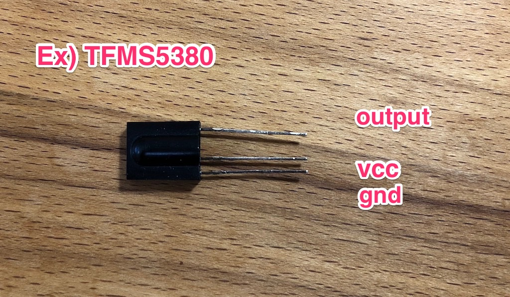

# IRSensor

Detecting Infrared signal like a remote controller's signal.

## wired(obniz, {output [vcc, gnd]})

Connect vcc and gnd and output. vcc and gnd is optional.

Various parts can be used. Belows are example.

1. [OSRB38C9AA](http://akizukidenshi.com/download/OSRB38C9AA.pdf)
1. [TFMS5380](https://www.voti.nl/docs/tfms5360.pdf) etc,,,

These parts has vcc/gnd/output
For examle, 




On program use it like

```javascript
// Javascript Example
var sensor = obniz.wired('IRSensor', {vcc:0, gnd:1, output: 2});
```

## start(callback(array))
start monitoring. and set detect callback.

```javascript
// Javascript Example
var sensor = obniz.wired('IRSensor', {vcc:0, gnd:1, output: 2});
sensor.start(function (arr) {
  console.log('detected!!')
  console.log(JSON.stringify(arr));
})
```

monitor options and these default value
See more details on logicanalyzer document

1. dataSymbolLength = 0.07; // data symbold length
2. duration = 200; // duration of signal. 200msec
3. dataInverted = true; // output values is inverted(IRSensor will re-invert)
4. trigerSampleCount = 16; // signal must start with 16 count of signals
5. cutTail = true; // cut tail not necesarry data arrays.
6. output_pullup = true; // output io must be pull-up to 5v.

You can chenge these before start.

```javascript
// Javascript Example
var sensor = obniz.wired('IRSensor', {vcc:0, gnd:1, output: 2});
sensor.duration = 150;
sensor.dataInverted = false;
sensor.start(function (arr) {
  console.log('detected!!')
  console.log(JSON.stringify(arr));
})
```

## ondetect = function(array)
set callback after started

```javascript
// Javascript Example
var sensor = obniz.wired('IRSensor', {vcc:0, gnd:1, output: 2});
sensor.start()

sensor.ondetect = function(arr) {
  console.log('detected!!')
  console.log(JSON.stringify(arr));
}
```