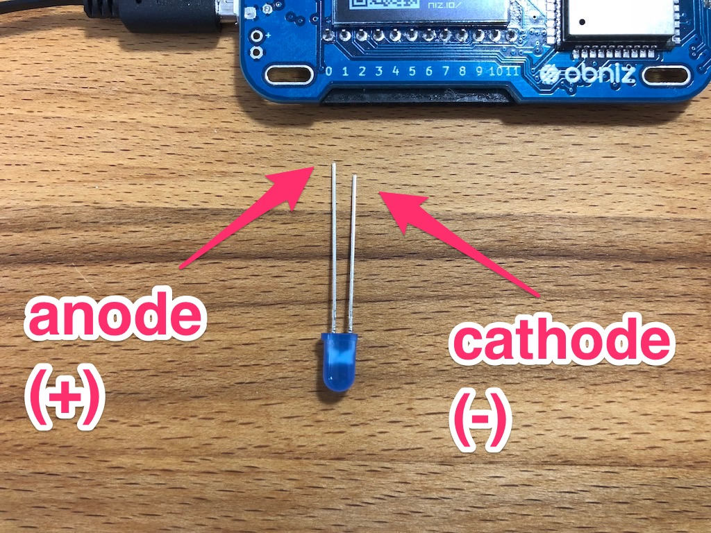
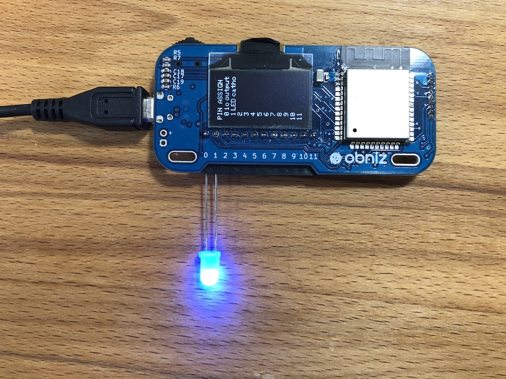

# LED
LED bright by supplying voltage.
It has two pins anode and cathode.
connect anode to plus and cathode to minus then it bright.
anode is a little bit longer than cathode.


## obniz.wired("LED", {anode, cathode})
anode is loger leg.
specify obniz io numbers you connected LED.

```Javascript
var led = obniz.wired("LED", {anode:0, cathode:1}); // io0 is connected to anode, io1 is cathode
```


```Javascript
var led = obniz.wired("LED", {anode:0}); // io0 is anode. cathode is connected obniz GND other way.
```
## on()
Simply, Turning on a LED.
It provide 5V to LED.

### Example
```Javascript
var led = obniz.wired("LED", {anode:0, cathode:1});

led.on();
```



## off()
Turning off a LED.

```Javascript
var led = obniz.wired("LED", {anode:0, cathode:1});

led.off();
```
## blink(interval_ms)
Start blinking a LED.
default interval is 100msec
```Javascript
var led = obniz.wired("LED", {anode:0, cathode:1});

led.blink(); // 100msec
```
## endBlink()
Stop blinking.
LED stops last state.
```Javascript
var led = obniz.wired("LED", {anode:0, cathode:1});

led.blink();
led.endBllink();
```