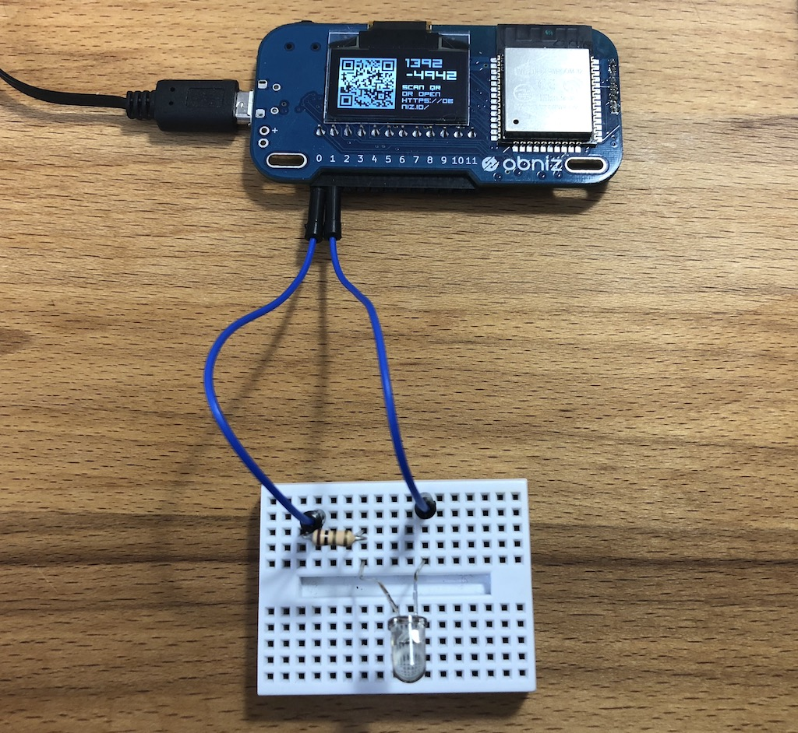

# InfraredLED

## wired(obniz, {anode, cathode})

anode,cathode is pin no of obniz io.
cathode is optional.

This module works with various InfraredLED  
For Example,

1. OSI5FU5111C
2. OSI5LA5113A
3. OSI3CA5111A etc,,,

### Add Resistor

Normally, An resistor is reuqired to connect LED to obniz.
Refer your LED's datasheet "Pulse Forward Current" like below. It is maximum value.
If it is 1000mA, then 1ohm is enough.


Then wire your LED to obniz 




## Example

```Javascript
// Javascript Example

// Example: Turn on KOIZUMI's Room Lamp
var led = obniz.wired('InfraredLED', {anode: 0, cathode: 1});
led.send([255,255,255,255,255,255,255,255,255,255,255,255,255,255,255,248,0,0,0,0,0,0,0,63,224,63,192,127,192,63,192,127,192,127,128,127,128,255,128,0,0,127,128,127,128,0,0,127,224,0,0,127,192,0,0,63,192,63,192,0,0,127,224,0,0,63,224,63,224,0,0,63,224,63,224,63,224,63,192,127,192,127,192,127,192,127,192,127,128,0,0,127,192,0,0,127,192,0,0,63,192,0,0,63,224,0,0,31,224,0,0,31,240,0,0,31,248,0])
```

## send(array)
send a array of signal.
data baud rate is defined in dataBaud(default 70usec)

This function use pwm.modulate. see more dtail on pwm document.

You can record your remote controller's signal by IRSensor module. Please refer it.

```Javascript
// Javascript Example
// Example: Turn on KOIZUMI's Room Lamp
var led = obniz.wired('InfraredLED', {anode: 0, cathode: 1});
led.send([255,255,255,255,255,255,255,255,255,255,255,255,255,255,255,248,0,0,0,0,0,0,0,63,224,63,192,127,192,63,192,127,192,127,128,127,128,255,128,0,0,127,128,127,128,0,0,127,224,0,0,127,192,0,0,63,192,63,192,0,0,127,224,0,0,63,224,63,224,0,0,63,224,63,224,63,224,63,192,127,192,127,192,127,192,127,192,127,128,0,0,127,192,0,0,127,192,0,0,63,192,0,0,63,224,0,0,31,224,0,0,31,240,0,0,31,248,0])
```

## dataBaud
baurate of signal array.
default is 70usec(0.07)

```Javascript
// Javascript Example
var led = obniz.wired('InfraredLED', {anode: 0, cathode: 1});
led.dataBaud = 0.1 // 100usec baud rate
led.send([224,63,192,127,192])
```