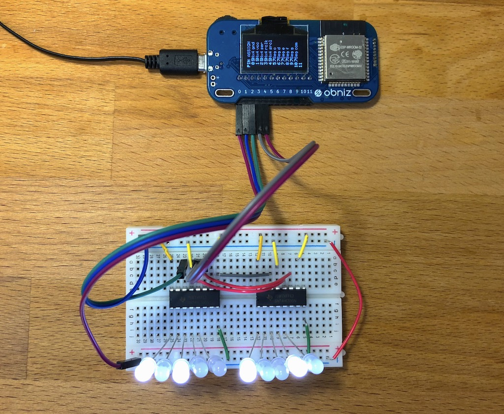

# SNx4HC595

SNx4HC595はSN54HC595やSN74HC595を扱うためのライブラリです。
1つのチップにある8個の出力できるIOを最低3本の信号線で制御できます。マイコンのIOを増やす時に使うことが多く、「IO拡張(IOエクステンダー)」と呼ばれています。
また、このチップは連続でつなぐことができるので、つなぐごとに使えるIOの数を8,16,24,,,と増やしていくことが出来ます。



Reference
[http://www.ti.com/lit/ds/symlink/sn74hc595.pdf](http://www.ti.com/lit/ds/symlink/sn74hc595.pdf)

## obniz.wired('SNx4HC595', {ser, rclk, srclk [, gnd, vcc, oe, srclr, io_num]});

チップの各ピンをどのobnizのioに接続したか設定します。

ser, rclk, srclkは必須です。それぞれつないだobnizのioを指定してください。

vcc gndはオプショナルです。別の5vにつないでいる場合は指定する必要はありません。
どちらかでも指定されている場合は、電源投入後にこの関数の中でwaitが入ります。

oeは出力ピンすべてをonでもoffでもないハイインピーダンスに切り替えるためのピンです。gndにつなぐことで、通常使用となります。
obnizにつながずにgndにつないでいる場合はwired関数で指定しなくても良いです。
指定した場合はsetEnable()関数が使えるようになります。

srclrはシフトレジスタの値をすべてクリアするためのピンです。low->highでクリアされます。5vなどに接続し、obnizから操作しない場合は指定する必要はありません。

io_numはioの数を指定します。1つのチップに8個までioがありますが、5などを指定すると、そのうちの5本のみ使用されます。
また、連続でチップが繋がれている場合は、ここの数字を増えたIOの数だけ指定します。
例えば2チップつないでいて、16ある場合はio_num:16とすることで操作できます。io_numはオプショナルで、デフォルトで8となっています。

```Javascript
// Javascript Example
var ioext = obniz.wired('SNx4HC595', {gnd:0, vcc:1, ser:2, rclk:3, srclk:4});
ioext.output(3, true)
```

```Javascript
// Javascript Example
var ioext = obniz.wired('SNx4HC595', {gnd:0, vcc:1, ser:2, rclk:3, srclk:4, io_num:16});
ioext.output(0, true)  // first chip's io
ioext.output(15, true) // next chip's io
```

## ioNum(num)

使用するioの数を指定します。wired()関数でio_numを指定するのと同じです。
指定した時にその数だけ出力はfalseに設定されます。
```Javascript
// Javascript Example
var ioext = obniz.wired('SNx4HC595', {gnd:0, vcc:1, ser:2, rclk:3, srclk:4});
ioext.ioNum(16);
ioext.output(15, true)
```

## output(io, value)
あるioの出力をtrue/falseに設定します。他のioは影響を受けません。

```Javascript
// Javascript Example
var ioext = obniz.wired('SNx4HC595', {gnd:0, vcc:1, ser:2, rclk:3, srclk:4});
ioext.output(3, true)
ioext.output(4, true) // io4 will be changed to true "after" io3 changed to true.
ioext.output(5, true)
```

## onece(function)
このチップは出力を一斉に変更することが出来ます。
チップに繋がれている出力0と出力1を同じタイミングで変更したい時にこの関数を使うことが出来ます。
以下のように指定すると関数の中で行われるチップのio変更が同じタイミングになります。

```Javascript
// Javascript Example
var ioext = obniz.wired('SNx4HC595', {gnd:0, vcc:1, ser:2, rclk:3, srclk:4});
ioext.onece(function(){ // io 4 and 5 will be changed to false state at same timing.
  ioext.output(4, false)
  ioext.output(5, false)
})
```

## getIO(io)
それぞれの出力端子のioオブジェクトを取得します。ioオブジェクトはobnizのioのようにoutput()関数を呼ぶことができます。
また、obnizパーツライブラリの[LED](./LED)や[7SegmentLED](./7SegmentLED)のioとしても使用することが出来ます。

```Javascript
// Javascript Example
var ioext = obniz.wired('SNx4HC595', {gnd:0, vcc:1, ser:2, rclk:3, srclk:4});

var io1 = ioext.getIO(1);
io1.output(true);

var io2 = ioext.getIO(2);
var led = obniz.wired("LED", {anode: io2});
led.blink();

var io3 = ioext.getIO(3);
var io4 = ioext.getIO(4);
var seg = obniz.wired("7SegmentLED", {a:io3, b: io4, c: 5, d:6, e:7, f:8, g:9, common:10});
seg.print(0);
```

## setEnable(enabled)
oe端子をobnizにつないでいる場合にのみ使えます。
出力ピンをすべてハイインピーダンスにします。