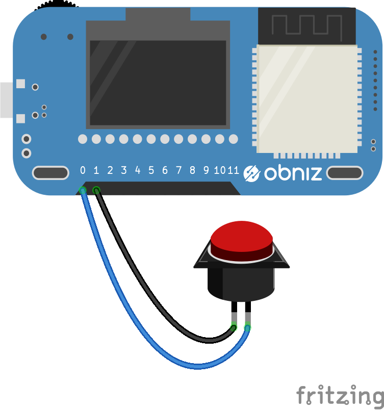

# Button
押すことで電流を流したり止めたり出来る部品です。これをつなぎ電流が流れているかを見ることでボタンが押されているかをチェックできます。このモジュールではボタンの形によらず、とにかく押せば電流が流れるボタンを扱うことができます。


## wired(obniz, {signal [,gnd,pull]})

ボタンにある２つのピンをobniz Boardにつなぎます。プラスとマイナスはありません。例えば片方をobniz Boardの0番に。もう片方を1番につないだ場合は以下のようにプログラム上でwireします



```Javascript
// Javascript Example
var button = obniz.wired("Button",  {signal:0, gnd:1});
```

gndはオプショナルです。他のGNDに繋いだ場合は、指定しなくても大丈夫です。

```Javascript
// Javascript Example
var button = obniz.wired("Button",  {signal:0});
```

pullはオプショナルです。デフォルトは5Vにプルアップされます。

次の3つのいずれかを選択ください。

- "5v" 5vに内部プルアップします。(デフォルト)
- "3v" 3vに内部プルアップします。
- "0v" gndにプルダウンします。

```Javascript
// Javascript Example
var button = obniz.wired("Button",  {signal:0,pull:"0v"});
```

## onchange = function(pressed){}
ボタンが押された時、離された時にcallback関数を呼び出します。

```Javascript
// Javascript Example
var button = obniz.wired("Button",  {signal:0, gnd:1});
button.onchange = function(pressed){
  console.log("pressed:" + pressed)
};
```

## [await] isPressedWait()
ボタンが押されているかを確認します。
```Javascript
// Javascript Example
var button = obniz.wired("Button",  {signal:0, gnd:1});
var pressed = await button.isPressedWait();
console.log("Pressed = " + pressed);
```


## [await] stateWait()
ボタンが押される／離されるまで待ちます
```Javascript
// Javascript Example
var button = obniz.wired("Button",  {signal:0, gnd:1});
await button.stateWait(true); 
console.log("button pushed!");
await button.stateWait(false); 
console.log("button released");
```