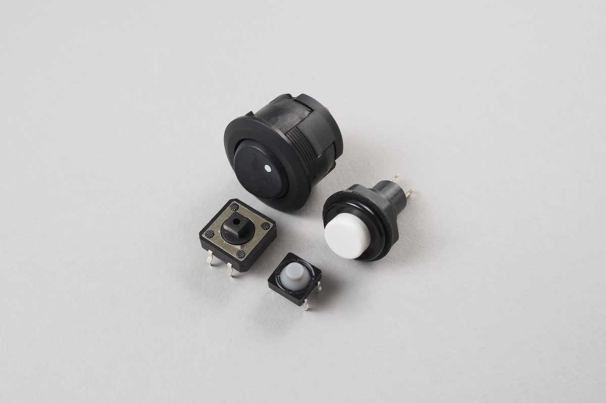

# Button
Button turn on/off electricity. Just monitor voltage to check button pressed or not.



## wired(obniz, {signal [,gnd,pull]})

Connect two pins to obniz Board. Many buttons has no pin direction. you can connect each one to signal,gnd.


```Javascript
// Javascript Example
var button = obniz.wired("Button",  {signal:0, gnd:1});
```

gnd is optional. It can be shared other gnd.

```Javascript
// Javascript Example
var button = obniz.wired("Button",  {signal:0});
```

pull is optional. The default is pulled up to 5V.

Select one of the following three options.

-"5v" Internal pull-up to 5v. (Default)
-"3v" Internal pull-up to 3v.
-"0v" Internal pull-down.


```Javascript
// Javascript Example
var button = obniz.wired("Button",  {signal:0,pull:"0v"});
```

## onchange = function(pressed){}
called when button pressed/released.

```Javascript
// Javascript Example
var button = obniz.wired("Button",  {signal:0, gnd:1});
button.onchange = function(pressed){
  console.log("pressed:" + pressed)
};
```

## [await] isPressedWait()
Check current button with waiting result.
```Javascript
// Javascript Example
var button = obniz.wired("Button",  {signal:0, gnd:1});
var pressed = await button.isPressedWait();
console.log("Pressed = " + pressed);
```


## [await] stateWait()
Wait until push/release button.
```Javascript
// Javascript Example
var button = obniz.wired("Button",  {signal:0, gnd:1});
await button.stateWait(true); 
console.log("button pushed!");
await button.stateWait(false); 
console.log("button released");
```