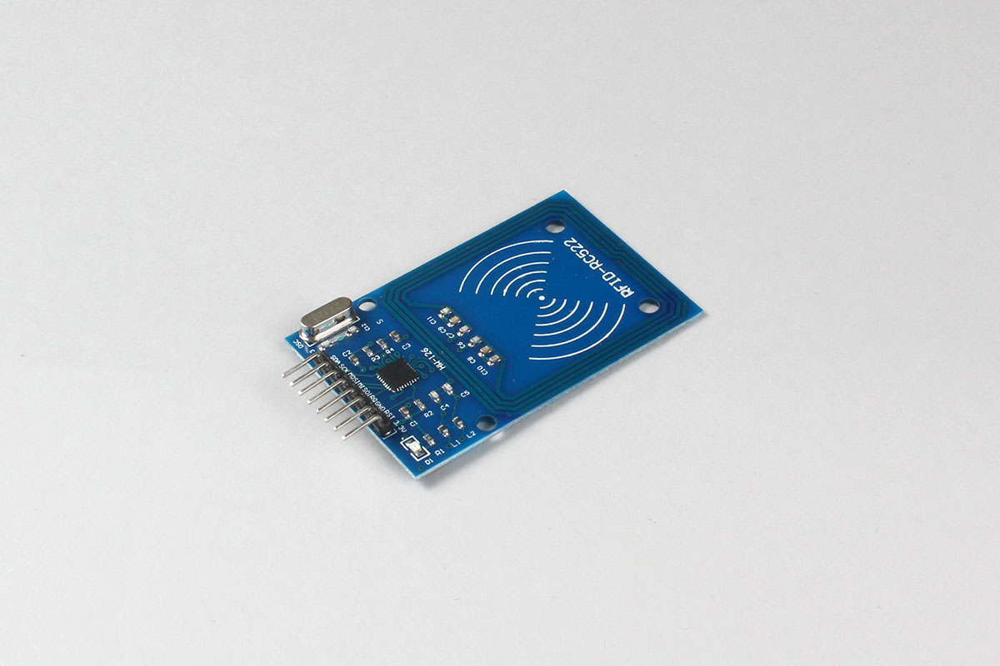
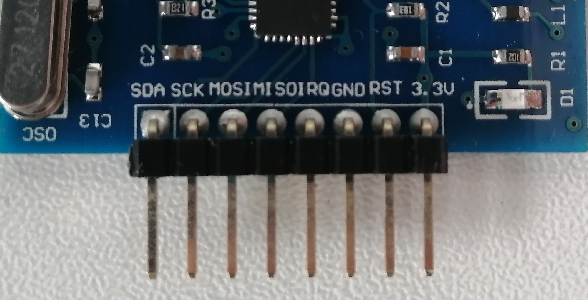

# RFID-RC522
RFID-RC522はNXP製のMFRC522チップを搭載したRFIDカードリーダー・ライターです．\
自身で所持しているポイントカードや学生証なども，MifareカードであればUIDを取得し識別する事が出来ます．\
また，3種類のサンプルプログラムを用意しました．\
dump	：カード内の全データ読取\
read 	：カード内の指定データの読取\
write 	：カードへ指定データの書込み


(左：RFID-RC522，右：データカード，データタグ)


## RFID-RC522の注意・説明
### 配線の注意
obnizの3Vピン設定は十分な電力ではないので、レギュレータで5Vピン設定を2.5-3.6V(3.3V推奨)に落としてください！

### ピンの設定
RFID-RC522には以下の様なピンがあります．



それぞれ以下の表のような対応になっています．
| RFID-RC522 		| obniz pin settings 	| wired()で宣言必須・不要|
|:-----------------:|:---------------------:|:---------------------:|
| SDA				| cs					| 必須					|
| SCK				| clk 					| 不要					|
| MOSI 				| mosi 					| 必須					|
| MISO 				| miso 					| 必須					|
| IRQ 				| - 					| -						|
| GND 				| gnd 					| 不要					|
| RST 				| RST 					| 必須					|
| 3.3V 				| vcc 					| 不要					|

### UID
カード固有のID番号．\
カードを識別する為に使います．

### PICC_Type
MFRC522チップは格納できるデータ量によって\
"MIFARE Mini, 320 bytes"，\
"MIFARE 1KB"，\
"MIFARE 4KB"，\
"MIFARE Ultralight or Ultralight C"，\
"MIFARE Plus"\
等の種類が存在します．

### MFRC522のメモリ構造
MFRC522はuidとPICC Typeのほかに書取，読取の出来るデータ列を用意しています．\
その構成は以下のようになっています．

|Sector (= 4Block)	|Block (= 16Byte)				|
|:-----------------:|:-----------------------------:|
|0 					|0(UID), 1, 2, 3(Reserved)		|
|1 					|4, 5, 6, 7(Reserved)			|
|2 					|8, 9, 10, 11(Reserved) 		|
|3					|12, 13, 14, 15(Reserved) 		|
|... 				|... 							|
|15					|60, 61, 62, 63(Reserved)		|

Block:0の16Byteの1部(通常先頭5Byte)はUIDとして予約されています．\
また，各Sectorの4Block目（Block:3, 7, 11...）は認証Blockとして予約されている為，ユーザーが使用可能なのは3Block分です．
UID, 認証Blockは書き換えると復帰不可能になる場合がある為，このライブラリでは書き込みを禁止しています．

また通常の"MIFARE 1KB"タイプであればBlock数は64個あり，メモリ量は\
64 Block × 16 Byte = 1,024 B = 1KB\
となります．\
もし他のタイプのカードであれば，メモリ量に対応したブロック数まで読むことが出来ます．\
ただしポイントカードなどの商用利用カードは認証パスワードが分からない為，内部のデータは読めません．UIDを取得できるだけです．

# ライブラリ内の関数

## wired("MFRC522", {cs, clk, mosi, miso, gnd, RST, vcc})
RFID-RC522は占有ピンが多い為，宣言不要ピンを設定しています．\
上記”ピン設定”の表で表した宣言必須ピンは必ず wired() 関数内で宣言する必要があります．\
宣言不要ピンは必ず wired() 関数内で宣言する必要はありませんが，その場合他のモジュールとのピンの共用が必要です．

```Javascript
// Parts Registration
var mfrc522 = obniz.wired("MFRC522", { cs: 0, clk: 1, mosi: 2, miso: 3, gnd: 4, RST: 5, vcc: 6});
```


## findCard() = function(uid, PICC_Type)

カードを探すための関数です．\
カードを検知すると，カードの'uid', 'PICC Type'が引数の要素に入ります．

```Javascript
// Find card
let response = await mfrc522.findCard();
console.log("Card is detected!");
console.log("UID		: " + response.uid);
console.log("PICC Type 	: " + response.PICC_Type);
```


## readBlockData() = function(Block, UID)
Block数とUIDを入れることで，1Block分のデータを取得できます．

```Javascript
// Read block data in the card
const Block = 4;
response = await mfrc522.readBlockData(Block, UID);
console.log("Block: " + Block + " Data: " + response);
```

## readSectorData() = function(Sector, UID)
Sector数とUIDを入れることで，4Block分のデータを配列で1度に取得できます．

```Javascript
// Read Sector data in the card
const Sector = 2;
response = await mfrc522.readSectorData(Sector, UID);
console.log("Sector: " + Sector);
for (let i = 0; i < 4; i++)
	console.log("Block: " + (Sector * 4 + i) + " Data: " + response[i]);
```

## writeBlockData(Block, data)
書き込みたいBlock数と16Byteのデータを入れることで，指定したブロックに指定したデータの書き込みが出来ます．

```Javascript
let data00 = [
	0x00, 0x00, 0x00, 0x00,
	0x00, 0x00, 0x00, 0x00,
	0x00, 0x00, 0x00, 0x00,
	0x00, 0x00, 0x00, 0x00
];
// Write block data to card
console.log("Writing data to Block " + Block + "...");
await mfrc522.writeBlockData(Block, data00);
console.log("Wrinting finished.");
```

# サンプルプログラムについての注釈
## alert(buzzer_pin)
注意：サンプルのhtml内で宣言している関数であり，ライブラリ内には存在しません．\
カードを検知したとき，操作が終了した時などにブザーを鳴らすための関数です．\
引数にブザーに繋いだピン番号を取ります．
## try_catch(err)について
サンプルプログラム中でtry_catch構文を用いています．\
これによってエラーした箇所でエラー内容を返しプログラムが止まる仕様になっています．その為エラーが重複する事はありません．\
エラーの種類はサンプルプログラムに書いてあるものが全てであり，エラー内容はlogに出るようになっています．\
よってユーザーは表示したいエラーのみを選択して表示することが出来ます．