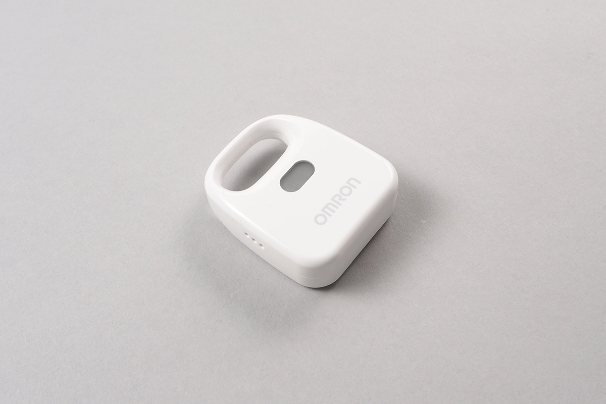

# 2JCIE
enviroment sensor made by OMRON




## wired(obniz)


```javascript
// Javascript Example
let omron = obniz.wired('2JCIE');

```


## [await] findWait()

Search device and return obniz.ble.peripheral object.
If not found, return null.

```javascript
// Javascript Example
let omron = obniz.wired('2JCIE');
let results = await omron.findWait();

if(results){
  console.log("find");
}else{
  console.log("not find");
}
```

## connectWait()

Connect to the device.
Search device automatically, but if not found, throw error.

```javascript
// Javascript Example
let omron = obniz.wired('2JCIE');
let results = await omron.findWait();

if(results){
    console.log("find");
  
    await omron.connectWait();
    let data = await omron.getLatestData();
    
    console.log(data);
}else{
    console.log("not find");
}
```


## [await]disconnectWait()
Disconnect from device.

```javascript
// Javascript Example
let omron = obniz.wired('2JCIE');
let results = await omron.findWait();

if(results){
    console.log("find");
  
    await omron.connectWait();
    let data = await omron.getLatestData();
    
    console.log(data);
    
    await omron.disconnectWait();
}else{
    console.log("not find");
}

```


## [await]getLatestData()
Get Latest Data from device.

```javascript
// Javascript Example

let omron = obniz.wired('2JCIE');
let results = await omron.findWait();

if(results){
    console.log("find");
  
    await omron.connectWait();
    let data = await omron.getLatestData();
    
    console.log(data);
    
    await omron.disconnectWait();
}else{
    console.log("not find");
}

```


The format is below.
```javascript

//example response
{
  row_number: 0,
  temperature: 22.91,   //degC
  relative_humidity: 46.46, //%RH
  light: 75, //lx
  uv_index: 0.02, 
  barometric_pressure: 1010.4000000000001, // hPa
  soud_noise: 39.42, //dB
  discomfort_index: 68.75,  
  heatstroke_risk_factor: 19,  //degC
  battery_voltage: 30.12  // V
}

```
