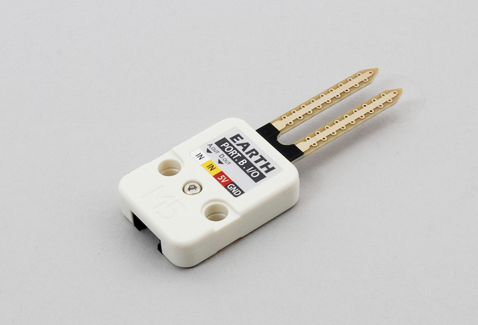

# Soil Moisture Sensor - EARTH



The soil moisture sensor, EARTH UNIT for M5STACK.  
It detect moisture level in soil.  
It has both analog and digital outputs.


## wired(obniz, { aout, dout, vcc, gnd })
connect EARTH UNIT to the obniz Board.  

name | type | required | default | description
--- | --- | --- | --- | ---
vcc | `number(obniz Board io)` | no |  &nbsp; | power supply
gnd | `number(obniz Board io)` | no |  &nbsp; | power supply
dout | `number(obniz Board io)` | no |  &nbsp; | digital out
aout | `number(obniz Board io)` | no | &nbsp;  | analog out
grove | `number(obniz Board io)` | no | &nbsp;  | grove property when device has a grove interface

```javascript
// JavaScript Example
var obniz = new Obniz.M5StickC("OBNIZ_ID_HERE");
obniz.onconnect = async function() {
  var earth = obniz.wired("Grove_EARTH", { grove: obniz.grove0 });
  earth.onchange = (val) => {
    console.log(val)
  }
}
```


## onchange = function(value)
callback function called when the value was changed.

the value indicate analog output voltage.
It will be reduced when getting water.

```javascript
var obniz = new Obniz.M5StickC("OBNIZ_ID_HERE");
obniz.onconnect = async function() {
  var earth = obniz.wired("Grove_EARTH", { grove: obniz.grove0 });
  earth.onchange = (val) => {
    console.log(val)
  }
}
```


## [await] getAnalogHumidityWait()
Measure and get current analog value once.

the value indicate analog output voltage.
It will be reduced when getting water.

```javascript
// Javascript Example
var sensor = obnizStick.wired("Grove_EARTH", { grove: obnizStick.grove0 });
var value = await sensor.getAnalogHumidityWait();
console.log('Humidity Level:' + value);
```


## [await] getDigitalHumidityWait()
Measure and get current digital value once.

```javascript
// Javascript Example
var sensor = obnizStick.wired("Grove_EARTH", { grove: obnizStick.grove0 });
var value = await sensor.getDigitalHumidityWait();
if (value) {
    console.log('Humidity level is toohigh!');
}
```