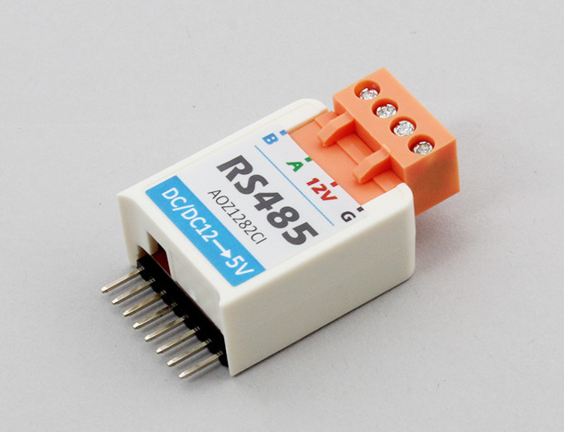

# M5StickC RS485
RS485-HAT is a TTL to RS485 converter for M5StickC.



## wired(obniz, {tx, rx,{vcc, gnd, baud}})

connect to the obniz device.
When using M5StickC, assign tx to 0, and rx to 26.
When using other devices, assign vcc and gnd as appropriate pins.

name | type | required | default | description
--- | --- | --- | --- | ---
vcc | `number(obniz Board io)` | no |  &nbsp; | Power Supply
gnd | `number(obniz Board io)` | no |  &nbsp; | Power Supply
tx | `number(obniz Board io)` | yes |  &nbsp; | tx
rx | `number(obniz Board io)` | yes | &nbsp;  | rx
baud | `number` | no | &nbsp;  | baudrate

```javascript
// Javascript Example
var rs485 = obniz.wired("M5StickC_RS485", {tx: 0, rx:26}); // M5stick C

rs485.onreceive = function(data, text) {
  console.log(text);
}
$("#send").click(function(){
  rs485.send("Hello")
})
```

## send(data)
send data via UART to RS485.
```javascript
// Javascript Example
var rs485 = obniz.wired("M5StickC_RS485", {tx: 0, rx:26}); // M5stick C
rs485.send("Hello")
```

## onreceive(data, text)
received data from RS485 via UART. This callback has same arguments with uart.onreceive()
```javascript
// Javascript Example
var rs485 = obniz.wired("M5StickC_RS485", {tx: 0, rx:26}); // M5stick C

rs485.onreceive = function(data, text) {
  console.log(text);
}
```
