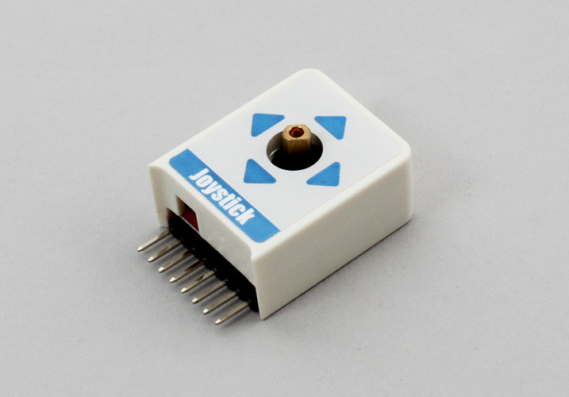

# StickC_JoyStick

X and Y direction with Push Switch Joystick.  
It uses the I2C communication.  



## wired(obniz, {[scl, sda, vcc, gnd]})

connect to the obniz device.  
When using M5StickC, You do not need to assign pins. 

```javascript
// JavaScript Examples
var obniz = new Obniz.M5StickC("OBNIZ_ID_HERE");
obniz.onconnect = async function() {
  var joystick = obniz.wired("StickC_JoyStick");
  while(true) {
    var x = await joystick.getXWait()
    var y = await joystick.getYWait()
    console.log(`${x}x${y}`);
    await obniz.wait(1);
  }
}
```


When using other devices, White, yellow, red and black wires correspond to scl, sda, vcc and gnd respectively.  


name | type | required | default | description
--- | --- | --- | --- | ---
vcc | `number(obniz Board io)` | no |  &nbsp; | Power Supply
gnd | `number(obniz Board io)` | no |  &nbsp; | Power Supply
scl | `number(obniz Board io)` | no |  &nbsp; | scl of I2C
sda | `number(obniz Board io)` | no | &nbsp;  | sda of I2C
i2c | `object` | no | &nbsp;  | obniz i2c object

```javascript
// JavaScript Examples
var obniz = new Obniz.M5StickC("OBNIZ_ID_HERE");
obniz.onconnect = async function() {
  var joystick = obniz.wired("StickC_JoyStick", {scl:26, sda:0});
  while(true) {
    var x = await joystick.getXWait()
    var y = await joystick.getYWait()
    console.log(`${x}x${y}`);
    await obniz.wait(1);
  }
}
```


## [await] isPressedWait()
get the button state once.   

```javascript
// JavaScript Examples
var joystick = obniz.wired("StickC_JoyStick", {scl:26, sda:0});
var isPressed = await joystick.isPressedWait();
if (isPressed) {
    console.log("Pressed!");
}
```


## [await] getXWait()
## [await] getYWait()

get X or Y angle once.

Value range is -127 to 127. center is 0. Device has individual difference. So minimum and maximum value is different on each joystick.

```javascript
// JavaScript Examples
var joystick = obniz.wired("Grove_JoyStick", { grove: obniz.grove0 });
while(true) {
  var x = await joystick.getXWait()
  var y = await joystick.getYWait()
  console.log(`${x}-${y}`);
  await obniz.wait(1);
}
```